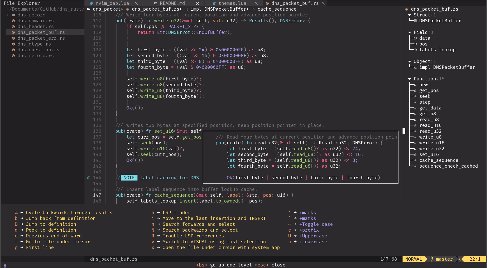
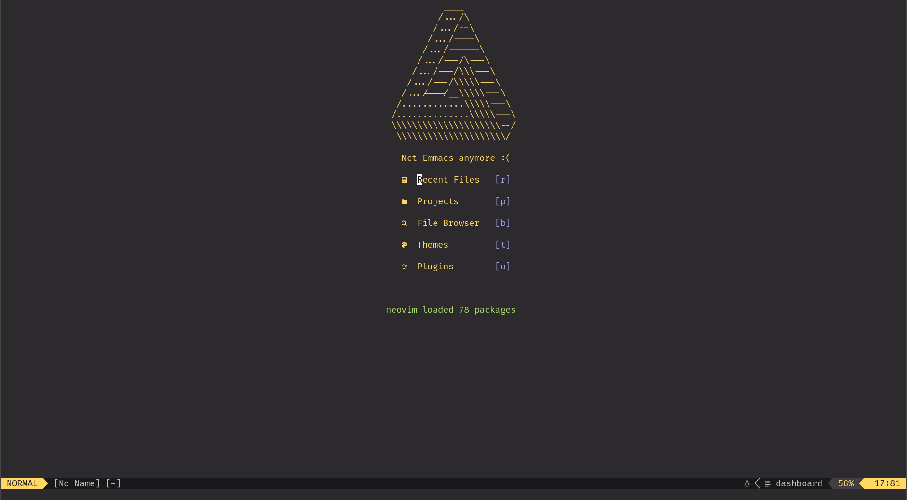
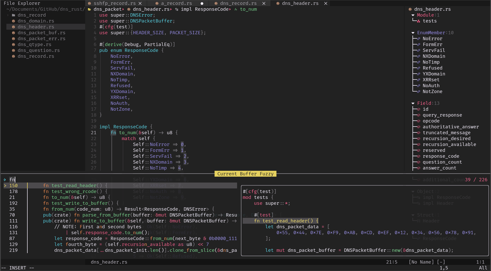
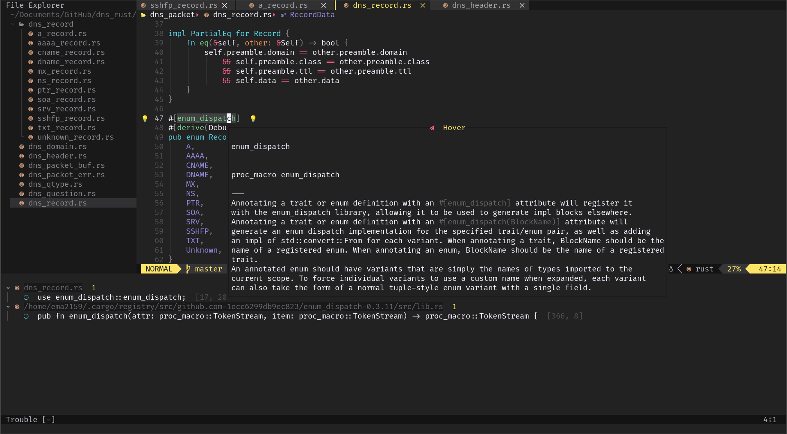
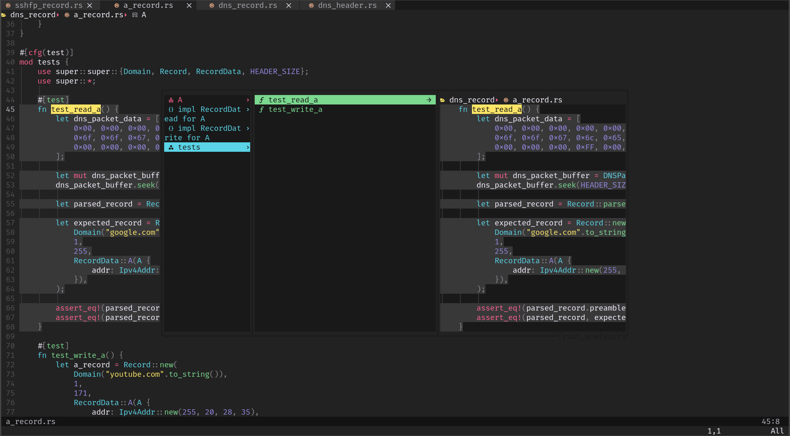
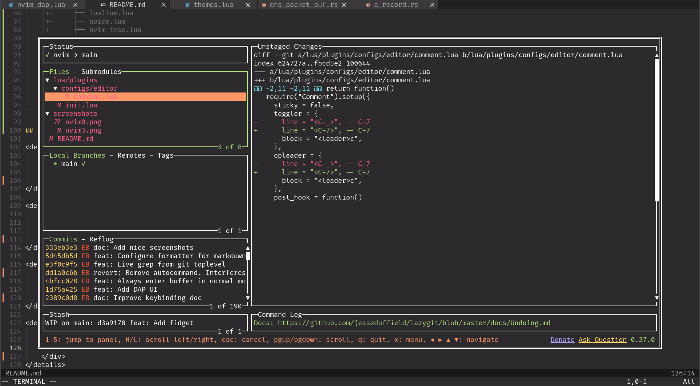

# nvimconfig

Personal Neovim configuration.

Switched from Emacs after 5 long years. So far, I am happy, though I might admit
I miss [Magit](https://magit.vc/) a little bit too much.

<div style="text-align:center">
    
</div>.

## Themes

<details>
    <summary>List</summary>

- Catppuccin
- Material
- One Dark
- Monokai Pro
- Dracula
- Kanagawa
- Gruvbox Material
- VSCode (Dark+ and Light+)
- Melange
- Nord
- Nightfly
- Moonfly
- Tokyonight
- Oxacarbon
- GitHub Nvim Theme
- Nightfox
- Rosé Pine
- Bluloco
- Solarized
</details>

## Configuration and plugins

```
lua
├── core
│   ├── init.lua
│   ├── keymaps.lua
│   ├── lazy.lua
│   └── options.lua
└── plugins
    ├── configs
    │   ├── editor
    │   │   ├── cmp.lua
    │   │   ├── comment.lua
    │   │   ├── hop.lua
    │   │   ├── luasnip.lua
    │   │   ├── move.lua
    │   │   ├── nvim_autopairs.lua
    │   │   └── nvim_surround.lua
    │   ├── themes
    │   │   ├── material.lua
    │   │   ├── monokai_pro.lua
    │   │   ├── onedark.lua
    │   │   └── solarized.lua
    │   ├── tools
    │   │   ├── deferred_clipboard.lua
    │   │   ├── diffview.lua
    │   │   ├── formatter.lua
    │   │   ├── lspconfig.lua
    │   │   ├── lspsaga.lua
    │   │   ├── lsp_signature.lua
    │   │   ├── mason.lua
    │   │   ├── navbuddy.lua
    │   │   ├── neodev.lua
    │   │   ├── null_ls.lua
    │   │   ├── nvim_dap.lua
    │   │   ├── nvim_dap_ui.lua
    │   │   ├── peek.lua
    │   │   ├── telescope.lua
    │   │   ├── toggleterm.lua
    │   │   ├── trouble.lua
    │   │   └── vim_mundo.lua
    │   └── ui
    │       ├── bufferline.lua
    │       ├── dashboard.lua
    │       ├── fidget.lua
    │       ├── gitsigns.lua
    │       ├── indent_blankline.lua
    │       ├── lualine.lua
    │       ├── noice.lua
    │       ├── nvim_tree.lua
    │       ├── todo_comments.lua
    │       ├── treesitter.lua
    │       ├── vim_illuminate.lua
    │       └── which_key.lua
    ├── editor.lua
    ├── init.lua
    ├── themes.lua
    ├── tools.lua
    └── ui.lua
```

## More screenshots

<details>
    <summary>Dashboard</summary>
    <div style="text-align:center">
        
    </div>
</details>

<details>
    <summary>Ivy-style searching</summary>
    <div style="text-align:center">
        
    </div>
</details>

<details>
    <summary>lspsaga-powered UI</summary>
    <div style="text-align:center">
        
    </div>
</details>

<details>
    <summary>nvim-navbuddy navigation</summary>
    <div style="text-align:center">
        
    </div>
</details>

<details>
    <summary>Lazygit integration</summary>
    <div style="text-align:center">
        
    </div>
</details>
